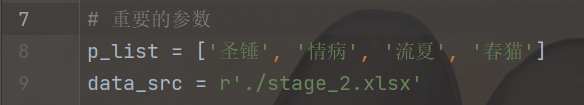
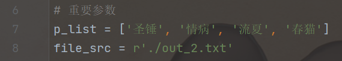

# Princess_Connect_Re_Dive_Association_Fight

## 前言

此代码为公主连接ReDive公会战排刀工具，将公会战的数据导入后即可筛出三刀可行的出刀方案。

## 运行环境

操作系统			windows 10

python				3.9.0

xlrd					1.2.0

simplejson		3.17.2

redis					3.5.3

## 运行方法

首先获取公会战的数据，可从此处获取https://docs.qq.com/sheet/DWkdtR2djbnFiUGRk?tab=ltc6xo&groupUin=21YR5EVZ7QKy8nD7P03Pyw%25253D%25253D&ADUIN=1035977573&ADSESSION=1623336994&ADTAG=CLIENT.QQ.5803_.0&ADPUBNO=27129

获取数据后，excel表格命名规则：

一阶段：stage_1.xlsx

二阶段：stage_2.xlsx

三阶段：stage_3.xlsx

放入同级目录中。

### data_maker_sp.py 文件

图1：

如图1所示，p_list 为筛选掉某个特定角色的列表，data_src 为公会战数据的相对地址，这些可根据需要自行修改。

### calculate_sp.py 文件

图2：

如图2所示，p_list 为筛选掉某个特定角色的列表，file_src 为输出结果的文件路径，这些可根据需要自行修改。

#### 两个 p_list 必须要一致

## 注意事项

#### 一、运行代码前需要先打开redis-server服务器，过程中必须一直打开。

#### 二、代码运行有先后顺序，先运行 data_maker_sp.py 执行完毕后再运行 calculate_sp.py 注意！注意！不能搞反！

#### 三、calculate_sp.py 执行可能有点慢，属于正常现象，大概需要3—5分钟吧

大概... ㄟ( ▔, ▔ )ㄏ

