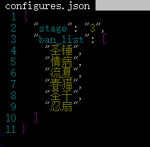
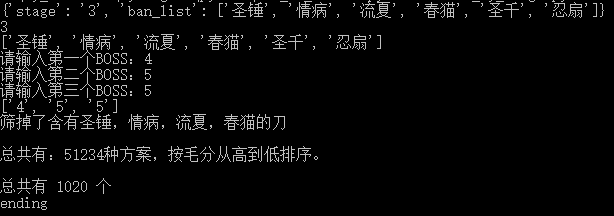

# Princess_Connect_Re_Dive_Association_Fight

## 前言

此代码为公主连接ReDive公会战排刀工具，将公会战的数据导入后即可筛出三刀可行的出刀方案。

## 运行环境

操作系统			windows 10

python				3.9.0

xlrd					1.2.0

simplejson		3.17.2

redis					3.5.3

## 运行方法

* 首先获取公会战的数据，[可从此处获取](https://docs.qq.com/sheet/DWkdtR2djbnFiUGRk?tab=ltc6xo&groupUin=21YR5EVZ7QKy8nD7P03Pyw%25253D%25253D&ADUIN=1035977573&ADSESSION=1623336994&ADTAG=CLIENT.QQ.5803_.0&ADPUBNO=27129)

* 获取数据后，excel表格命名规则：

  一阶段：stage_1.xlsx

  二阶段：stage_2.xlsx

  三阶段：stage_3.xlsx

  放入同级目录中。

* 修改 configures.json 配置文件

  stage 为当前阶段，A面对应"1"，B面对应"2"，C面对应"3"

  ban_list 为禁用的角色

  修改时注意格式

  

* 打开 redis-server 服务器

* 执行 data_maker_sp.py 文件

* 执行 calculate_sp.py 文件

  然后漫长的等待。。。。。。

  结果输出在对应的 out 文件中

* 接下来可以按想要打的BOSS组合进行搜索，执行 search_by_kings.py 文件

  根据提示输入BOSS组合，例如我想要打四王、五王、五王，那么应当输入4，5，5

  注意，输入数字应当严格按升序排列

  输出结果在 search.txt 文件中

  
  
* 搜索可以使用指令: 

  **python search_by_kings.py 1 5 5 C501** 

  **python search_by_kings.py 1 5 5 C501 C503** 

  **python search_by_kings.py [第一个BOSS] [第二个BOSS] [第三个BOSS] [已经出过的刀标号] ...**   

ps: 参考命令：

**python data_maker_sp.py** 

**python calculate_sp.py** 

**python search_by_kings.py** 

## 注意事项

#### 一、运行代码前需要先打开redis-server服务器，过程中必须一直打开。

#### 二、代码运行有先后顺序，先运行 data_maker_sp.py 执行完毕后再运行 calculate_sp.py 注意！注意！不能搞反！

#### 三、calculate_sp.py 执行可能有点慢，属于正常现象，大概需要3—5分钟吧

大概... ㄟ( ▔, ▔ )ㄏ

