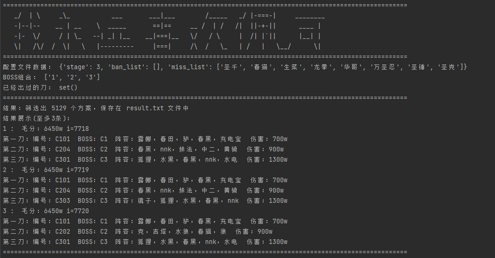

# Princess_Connect_Re_Dive_Association_Fight

## 前言

此代码为公主连接ReDive公会战排刀工具，将公会战的数据导入后即可筛出三刀可行的出刀方案。

新版本v2.0.0:

该版本在原来的算法基础上进行了大幅度调整，不再使用redis数据库

## 运行环境

操作系统			windows 10

python				3.9.0

xlrd					1.2.0

simplejson		3.17.2

## 运行方法

* 首先获取公会战的数据，[可从此处获取](https://docs.qq.com/sheet/DWkdtR2djbnFiUGRk?tab=ltc6xo&groupUin=21YR5EVZ7QKy8nD7P03Pyw%25253D%25253D&ADUIN=1035977573&ADSESSION=1623336994&ADTAG=CLIENT.QQ.5803_.0&ADPUBNO=27129)

* 获取数据后，excel表格命名规则：

  一阶段：stage_1.xlsx

  二阶段：stage_2.xlsx

  三阶段：stage_3.xlsx

  放入同级目录中。

* 修改 configures.json 配置文件

  stage 为当前阶段，A面对应"1"，B面对应"2"，C面对应"3"

  ban_list 为禁用的角色

  修改时注意格式

  

  或者可以使用命令的方式进行修改：

  **python main.py --config stage=3** 

  **python main.py --config add ban_list 春猫** 

  **python main.py --config remove ban_list 春猫** 

* 制作中间数据

* 计算排刀方案

* 默认用法：**python main.py** 

  如果没有 ./temp/out_x.txt 文件则计算中间数据，计算排刀方案（可能会有点久）

  如果文件已经存在，则进行排刀搜索

  

* 制作数据指令

  **python main.py -m** 

* 计算排刀指令

  **python main.py -c** 

* 搜索可以使用指令: 

  **python main.py -s 1 5 5 C501** 

  **python main.py -s 1 5 5 C501 C503** 

  **python main.py -s [第一个BOSS] [第二个BOSS] [第三个BOSS] [已经出过的刀标号] ...**   
  
* 自动刀搜索指令：

  **python main.py -a 1 5 5 C501** 

  **python main.py -a 1 5 5 C501 C503** 

  **python main.py -a [第一个BOSS] [第二个BOSS] [第三个BOSS] [已经出过的刀标号] ...**   

  

## 注意事项

算的过程可能有点慢，不过搜索还是挺快的

新版和旧版变化很大（感觉新版改崩了，如果有机会可能出个第三版）
