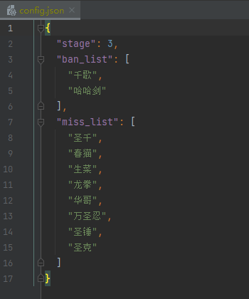

# Princess_Connect_Re_Dive_Association_Fight

## 前言

此代码为公主连接ReDive公会战排刀工具，将公会战的数据导入后即可筛出三刀可行的出刀方案。

新版本v2.0.0:

该版本在原来的算法基础上进行了大幅度调整，不再使用redis数据库

## 运行环境

操作系统			windows 10

python				3.9.0

xlrd					1.2.0

simplejson		3.17.2

## 运行方法

* 安装项目：

  ```bash
  git clone [仓库地址.git]
  ```

* 项目初始化：

  ```bash
  python init.py
  ```

  此时生成了 config.json 文件和 stage_1.xlsx, stage_2.xlsx, stage_3.xlsx 三个表格

  config.json 是配置文件，需要自行设置。

  stage_x.xlsx 表格是公会战的作业数据，需要从网上下载（数字对应三个阶段，不要改变文件名）

* 获取公会战的数据，[可从此处获取](https://docs.qq.com/sheet/DWkdtR2djbnFiUGRk?tab=ltc6xo&groupUin=21YR5EVZ7QKy8nD7P03Pyw%25253D%25253D&ADUIN=1035977573&ADSESSION=1623336994&ADTAG=CLIENT.QQ.5803_.0&ADPUBNO=27129)

* 获取数据后，excel表格命名规则：

  一阶段：stage_1.xlsx

  二阶段：stage_2.xlsx

  三阶段：stage_3.xlsx

  放入同级目录中。

* 修改 config.json 配置文件

  stage 为当前阶段，A面对应"1"，B面对应"2"，C面对应"3"

  ban_list 为禁用的角色

  miss_list 为没有抽出来的角色

  修改时注意格式

  

* 开始数据分析

  ```bash
  python analyse.py
  ```

* 根据要打的BOSS进行排刀搜索

  ```bash
  # 格式：BOSS需要按顺序——升序，已经打过的刀为可选项
  # python search [BOSS1] [BOSS2] [BOSS3] <已经出过的刀1> <已经出过的刀2>
  # 实例：
  python search 1 2 3 C104
  
  # 自动刀格式：BOSS需要按顺序——升序，已经打过的刀为可选项
  # python search -a [BOSS1] [BOSS2] [BOSS3] <已经出过的刀1> <已经出过的刀2>
  # 实例：
  python search -a 1 2 3 ct203
  ```

  

  

## 注意事项

注意修改config.json文件

